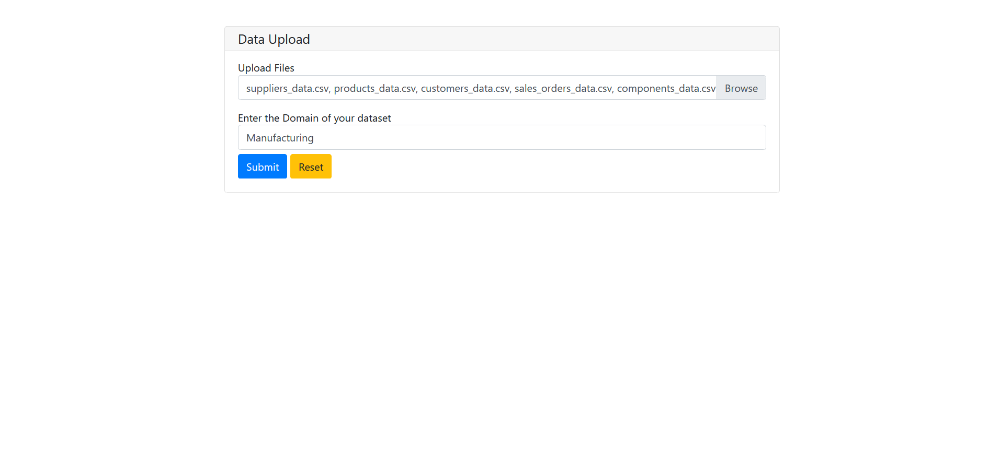
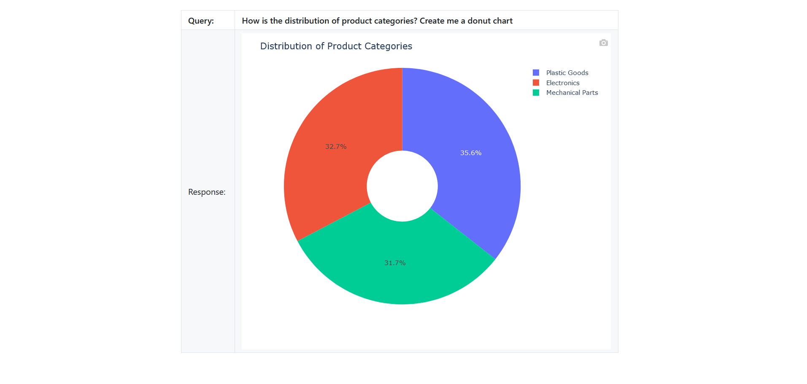

# AutoDataAnalyzer

**AutoDataAnalyzer** is a cutting-edge tool designed to automate the process of data ingestion, analysis, and visualization using powerful AI/ML models and interactive pipelines. This application provides a seamless experience for uploading datasets, querying data, and generating insightful visualizations.

---

## Features

- **Interactive Data Analysis**: Upload datasets and metadata, then query for insights.
- **Automated Visualization**: Generates high-quality, interactive Plotly visualizations.
- **Custom Query Handling**: Uses advanced LLMs (Llama 3.3-70B) for natural language query processing.
- **Pipeline Integration**: End-to-end processing via LangChain and other robust frameworks.
- **Dockerized Deployment**: Easy setup with Docker support.
- **CI/CD Workflow**: Fully automated CI/CD pipeline using GitHub Actions.

---

## Table of Contents

1. [Directory Structure](#directory-structure)
2. [Technical Details](#technical-details)
3. [Requirements](#requirements)
4. [Installation](#installation)
5. [Usage](#usage)
6. [Screenshots](#screenshots)
7. [License](#license)

---

## Directory Structure

```
RauhanAhmed-Auto-Data-Analyzer/
├── .github/
│   └── workflows/
│       └── ci-cd.yaml
├── app.py
├── requirements.txt
├── setup.py
├── params.yaml
├── config.ini
├── Dockerfile
├── LICENSE
└── src/
    ├── components/
    │   ├── queryChainBuilder.py
    │   ├── dataIngestion.py
    │   ├── __init__.py
    │   └── codeGenerator.py
    ├── __init__.py
    ├── pipelines/
    │   ├── __init__.py
    │   └── pipeline.py
    └── utils/
        ├── logger.py
        ├── exceptions.py
        ├── __init__.py
        └── functions.py
```

---

## Technical Details

### Tools and Frameworks

- **Programming Language**: Python 3.10
- **Web Framework**: Flask
- **Interactive Interface**: PyWebIO
- **Visualization**: Plotly
- **Large Language Model**: Llama 3.3-70B
- **Task Management**: LangChain (including experimental and community modules)
- **Deployment**: Docker
- **CI/CD**: GitHub Actions

---

## Requirements

- Python 3.10
- Docker
- Dependencies listed in `requirements.txt`

---

## Installation

1. Clone the repository:
   ```bash
   git clone https://github.com/RauhanAhmed/AutoDataAnalyzer.git
   cd AutoDataAnalyzer
   ```

2. Install dependencies:
   ```bash
   pip install -r requirements.txt
   ```

3. Run the application:
   ```bash
   python app.py
   ```

4. (Optional) Build and run using Docker:
   ```bash
   docker build -t autodataanalyzer .
   docker run -p 7860:7860 autodataanalyzer
   ```

---

## Usage

1. Launch the application by running `app.py` or starting the Docker container.
2. Upload your CSV files to begin.
3. Review the automatically generated metadata.
4. Submit your question using natural language.
5. View the resulting visualization and export it if needed.
6. Type `exit` to close the application.


---

## Screenshots





---

## License

This project is licensed under the MIT License. See the [LICENSE](./LICENSE) file for details.

---

## Author

Developed by [**Rauhan Ahmed Siddiqui**](https://github.com/RauhanAhmed/Auto-Data-Analyzer).
